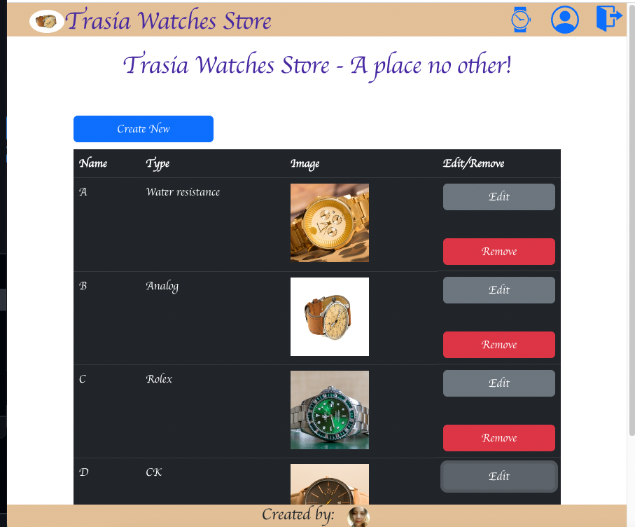
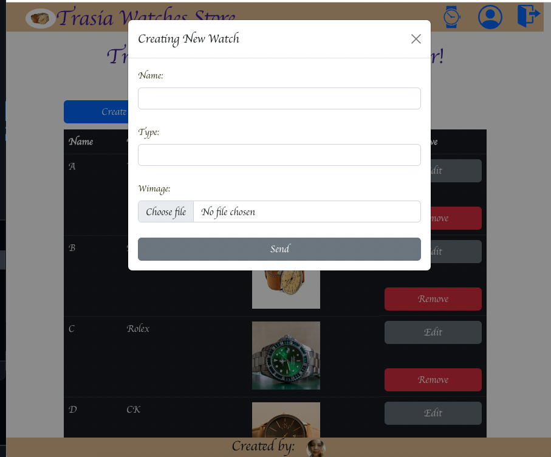
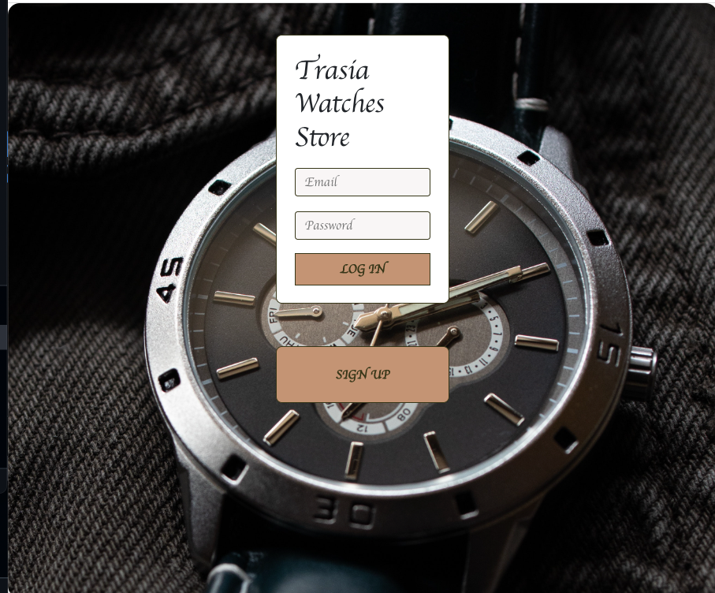
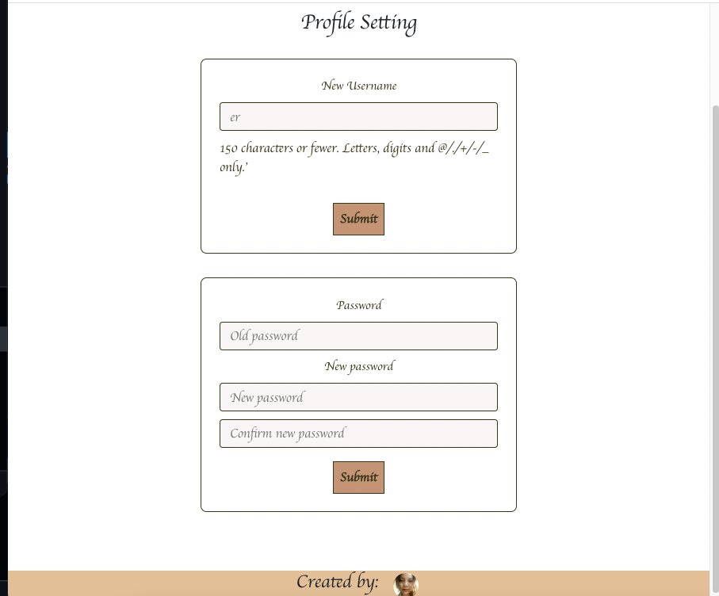
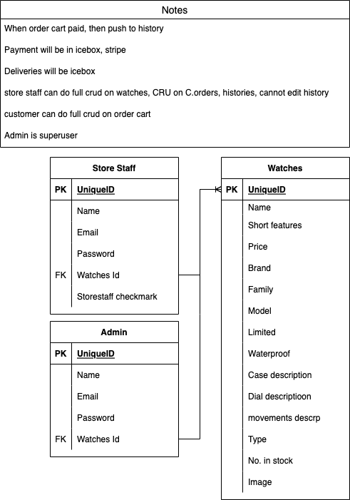

# [Trasia-Watches-Store](https://twsfe.vercel.app/)
Heroku deploy for [Trasia-Watches-Store](https://trasia-watches-store.herokuapp.com/)
This application is designed for staff of Trasia-Watches-Store to manage stock and their accounts settings.

## Premise
As a user I want to be able to see, check, edit, add, and delete products. I also want to change my account settings. I want to feel safe when signup as a new staff or login and logout safely.

## ScreenShots

## Technologies Used
* postgresql
* django
* python
* pip
* React
* Nodejs
* Javascript
* CSS (Bootstrap)
* HTML

## ERD

## Trello board
[Trello board](https://trello.com/b/MUu4lGji/trasia-watch-store)